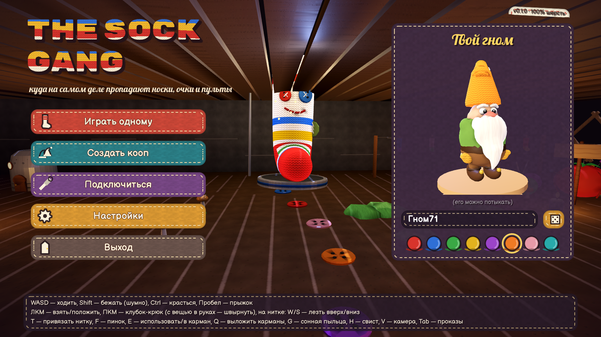
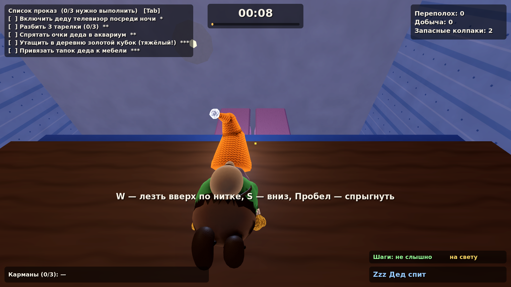
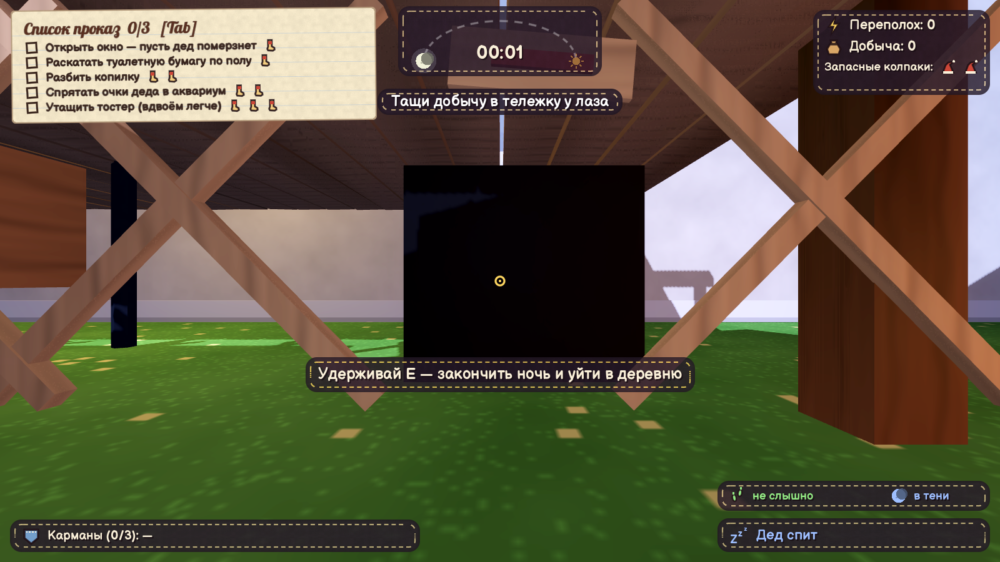
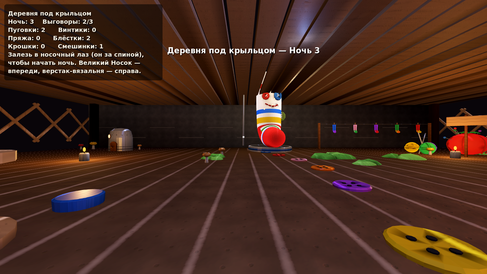
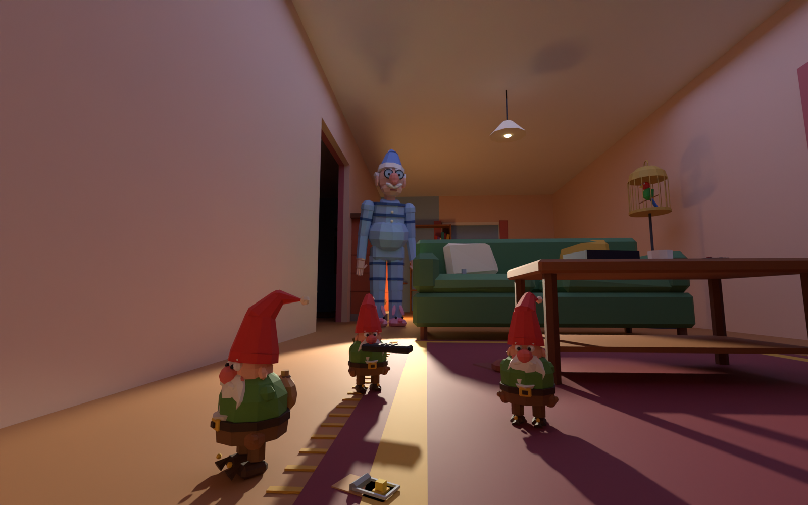

# 🧦 The Sock Gang

> Куда пропадают вторые носки, очки и пульт от телевизора? Это мы. Гномы из-под крыльца.

Кооперативная (до 6 игроков) и одиночная 3D-игра. Маленькие гномы-проказники по ночам
пробираются в дом ворчливого деда. Они выполняют проказы из списка Великого Носка, таскают вещи
в деревню под крыльцом и стараются не попасть в банку из-под огурцов.

Все модели сделаны с нуля скриптами в **Blender**: низкополигональные, яркие и нарочно смешные.

## ⬇️ Скачать и играть

**[Скачать последнюю сборку →](https://github.com/nem1k9/games/releases/latest)** Ничего устанавливать не нужно.

- **Windows:** скачайте `SockGang-Windows.zip`, распакуйте и запустите `SockGang.exe`.
  Если появится «Windows защитила ваш компьютер», нажмите **Подробнее → Выполнить в любом случае**: игра просто не подписана сертификатом.
- **Linux:** скачайте `SockGang-Linux.zip`, распакуйте и запустите `./SockGang.x86_64`.

Новая сборка появляется там сама после каждого изменения игры. Перед публикацией GitHub Actions
собирает игру и прогоняет её автотест: одиночную ночь и кооператив хоста с клиентом.

| | |
|---|---|
|  |  |
|  |  |

<sub>Скриншоты из самой игры.</sub>

Ниже — превью уровней, собранных в Blender по тем же данным, что и в игре:




| | |
|---|---|
|  |  |
|  |  |


Подробный диздок: [docs/DESIGN.md](docs/DESIGN.md).

---

## Управление

| Клавиша | Действие |
|---|---|
| **WASD** | ходить |
| **Shift** | бежать (громко!) |
| **Ctrl / C** | красться (тихо, прячет от попугая) |
| **Пробел** | прыжок; в воздухе с колпаком-парашютом — планировать |
| **ЛКМ** | взять / положить вещь |
| **ПКМ** | с вещью в руках — швырнуть; без вещи — **клубок-крюк** (ещё раз — отцепить) |
| **Колесо мыши** | смотать / размотать нитку (или приблизить / отдалить вещь в руках) |
| **W / S** (на нитке) | лезть вверх / вниз по нитке; у края стола или полки гном сам забирается наверх |
| **A / D** (на нитке) | раскачиваться; **Пробел** — спрыгнуть |
| **T** | привязать нитку к тому, на что смотришь (связать две вещи, например тапки деда) |
| **F** | пинок; в банке или в руках деда — вырываться |
| **E** | использовать / положить в карман; держать у банки — откручивать крышку; держать у лаза — уйти домой |
| **Q** | выложить всё из карманов |
| **G** | бросить сонную пыльцу (усыпляет деда) |
| **H** | свистнуть (позвать друзей или отвлечь) |
| **V** | вид от первого / третьего лица |
| **Tab** | развернуть список проказ |
| **Enter** | чат (в кооперативе) |
| **Esc** | пауза / настройки |

Для тестирования: **F3** — отладочная информация (FPS, пинг, состояние деда и кота).
Хосту и в одиночной игре также доступны: **F6** — сразу начать ночь, **F7** — закончить ночь, **F8** — разбудить деда, **F9** — уложить его спать.

## Как играть

1. **Деревня под крыльцом.**
   - Поговорите с **Великим Носком** (E): он даёт советы и хвалит за проказы. Список проказ на ночь появится на экране, когда ночь начнётся.
   - В **вязальне** из добычи вяжется снаряжение: длинная пряжа, тихие пинетки, колпак-парашют, очки ночного видения и др.
   - **Носочный лаз** ведёт в дом. Когда все гномы залезут в лаз, начнётся ночь.
2. **Ночь (8 минут, 00:00 → 06:00).**
   - Выполните хотя бы **3 проказы**: смыть уточку, спрятать дедовы очки в аквариум, связать тапки, раскатать туалетную бумагу…
   - Добычу тащите в **сардинную тележку** у лаза: там она превращается в материалы.
3. **Опасности.**
   - **Дед** просыпается от шума. Пойманного гнома он закатывает в банку на полке, а высоко забравшегося прихлопывает мухобойкой.
   - **Попугай Кеша** орёт «ВОРЫ!» — накройте клетку полотенцем или дайте печеньку.
   - **Кот** охотится на гномов.
   - Под ногами **мышеловки** и **скрипучие половицы**.
4. **Спасение.**
   - Друга в банке можно открутить (держать E у крышки).
   - От прихлопнутого гнома остаётся колпак. Отнесите его в **корзинку с клубками** у лаза, и гном вернётся.
   - В одиночной игре есть 2 запасных колпака.

## Пасхалки

В игре спрятаны секреты. Несколько подсказок:
- в главном меню работает один очень старый чит-код (↑↑↓↓…) — он вяжет кое-что радужное;
- гнома в меню можно тыкать. Но недолго;
- попробуй назвать гнома «дед», «Кеша» или «Гэндальф»;
- кубик рядом с именем иногда выдаёт легендарные имена (один раз из сорока);
- Великий Носок знает секреты — надо только правильно посвистеть (H);
- зимой в меню идёт снег.

## Кооператив

- **Хост:** главное меню → «Создать игру». Хост держит мир: деда, кота, вещи. Порт по умолчанию **UDP 27777**, его можно поменять.
- **Остальные:** «Присоединиться».
  - Игры в локальной сети сами появляются в списке.
  - Либо введите IP хоста и порт.

Как играть через интернет, если вы не в одной сети:

| Способ | Что сделать |
|---|---|
| **Radmin VPN / ZeroTier / Hamachi** (проще всего) | Все заходят в одну виртуальную сеть. Хост сообщает свой виртуальный IP (например, `26.x.x.x`), остальные подключаются к нему. |
| **Проброс порта** | На роутере хоста пробросить **UDP 27777** на его компьютер и разрешить игру в брандмауэре Windows. Друзья подключаются к внешнему IP хоста. |

Прогресс (материалы, снаряжение, номер ночи) хранится у хоста. На Windows это `%APPDATA%\\Godot\\app_userdata\\The Sock Gang\\sockgang_save.txt`, на Linux — `~/.local/share/godot/app_userdata/The Sock Gang/`.

## Статус и как это проверялось

Игра написана целиком: одиночный режим и кооператив, деревня и дом, дед, кот и попугай, проказы, вязание снаряжения, сохранения, меню и настройки на двух языках.

Готовая сборка работает на движке **Godot 4.5 (.NET)**: он собирается без лицензий и прямо на серверах GitHub.
Правила игры, сеть и модели — общий код на C# (`Assets/Scripts/Core`, `Assets/Scripts/Net`). Его используют обе версии: Godot в `godot/` и исходная Unity в `Assets/`.

Как проверялось:
- **Автотест игры** (`--autotest`) запускает настоящую игру и проходит ночь за гнома. Проверяется 25 пунктов:
  - деревня и дом строятся, навигация деда работает;
  - вещи летают и падают внутрь дома, лампы и холодильник работают;
  - дед просыпается и ловит гнома, банка и побег из неё, мухобойка и запасной колпак;
  - добыча уходит в тележку, сохранение растёт, игра возвращается в меню.

  Отдельно проверяется кооператив: хост и клиент по UDP. Тест проходит в редакторе, в собранной версии для Linux и в `SockGang.exe` (Windows, через Wine). Перед каждым релизом его запускает CI.
- **Юнит-тесты (325).** Покрывают правила, проказы, прогрессию, формат моделей, сетевой протокол и настоящий UDP (хост и два клиента, поиск игр в LAN).
  - Для 40 сгенерированных домов проверено: мебель не пересекается, двери свободны, мышеловки не спрятаны.
  - Каждый узел модели, который ищет код, есть в моделях из Blender.
  - Каждая строка интерфейса переведена.
- **Unity-версия** компилируется против настоящих сборок UnityEngine и UnityEditor (`tools/UnityCheck`, также в CI).

Скорости, чувствительность деда и прочие числа собраны в `Assets/Scripts/Core/GameConsts.cs`. Для настройки есть отладочные клавиши F3 и F6–F9.

## Устройство проекта

```
godot/              версия на Godot 4.5 (.NET) — из неё собирается готовая игра
  src/              мир, гномы, дед/кот/попугай, сессия, звук, интерфейс, автотест
  models/           те же модели GMDL, что и в Unity
Assets/
  Scripts/Core/     правила игры без Unity: предметы, проказы, прогрессия, планировка дома,
                    сетевые сообщения, загрузчик моделей GMDL (покрыто тестами)
  Scripts/Net/      транспорт на LiteNetLib: хост/клиент, поиск игр в локальной сети
  Scripts/Game/     Unity-версия: гномы, дед/кот/попугай, мир, сессия, звук, интерфейс
  Editor/           автонастройка проекта и меню сборки (Unity)
  Resources/Models/ модели, экспортированные из Blender (*.bytes, формат GMDL)
blender/            скрипты моделей (Python + bpy): персонажи, мебель, предметы, деревня
art/                .blend и .fbx каждой модели (для правок руками)
docs/               диздок и превью моделей
Tests/              xUnit-тесты: правила, модели, сеть (настоящий UDP через localhost), планировка
tools/LevelDump/    выгрузка сгенерированного дома в JSON (для превью в Blender)
tools/UnityCheck/   проверка, что все скрипты Unity компилируются (без самого Unity)
```

### Для разработчиков

- **Godot-версия** (из неё собирается релиз): откройте папку `godot/` в Godot 4.5 .NET и нажмите ▶. Автотест: `godot --path godot -- --autotest=solo`.
- **Unity-версия:** откройте корень репозитория в Unity Hub (Unity 6 или 2021.3+) и нажмите ▶ в сцене `Assets/Scenes/Main.unity`.

```bash
# тесты правил, моделей, сети и планировки дома (313 шт.)
dotnet test Tests/Gnomes.Tests

# проверить, что игровой и редакторный код компилируется против UnityEngine/UnityEditor
dotnet build tools/UnityCheck/Editor.csproj

# пересобрать все модели из Blender (нужен pip install bpy, Python 3.11)
python3 blender/build.py            # всё: GMDL + FBX + .blend + превью
python3 blender/build.py gnome cat  # только эти модели
python3 blender/build.py --sheet    # плюс общая картинка docs/models_sheet.png

# скриншоты уровней без Unity: планировка дома из генератора игры -> сборка и рендер в Blender
dotnet run --project tools/LevelDump -c Release -- 12345 /tmp/layout.json
python3 blender/preview_level.py house /tmp/layout.json docs/shots/house_cutaway.png --view=cutaway
python3 blender/preview_level.py village docs/shots/village.png

# .meta-файлы для новых ассетов (стабильные GUID)
python3 tools/gen_meta.py
```

Все эти проверки запускает GitHub Actions при каждом пуше (`.github/workflows/ci.yml`).
