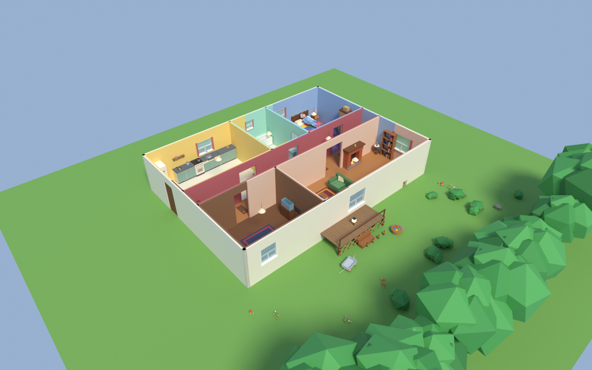
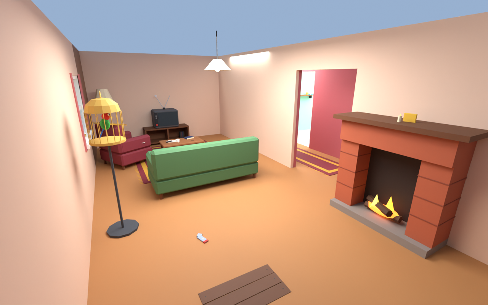
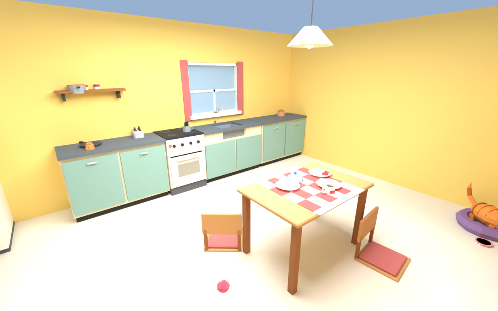
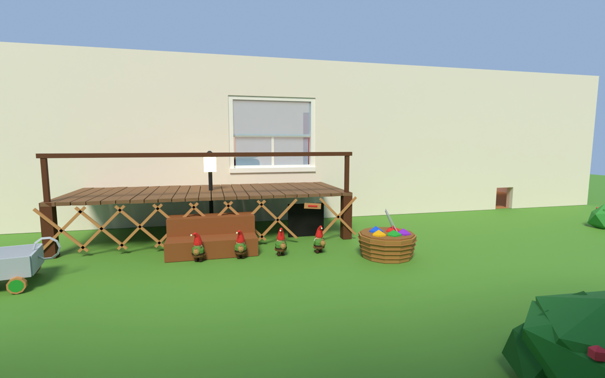
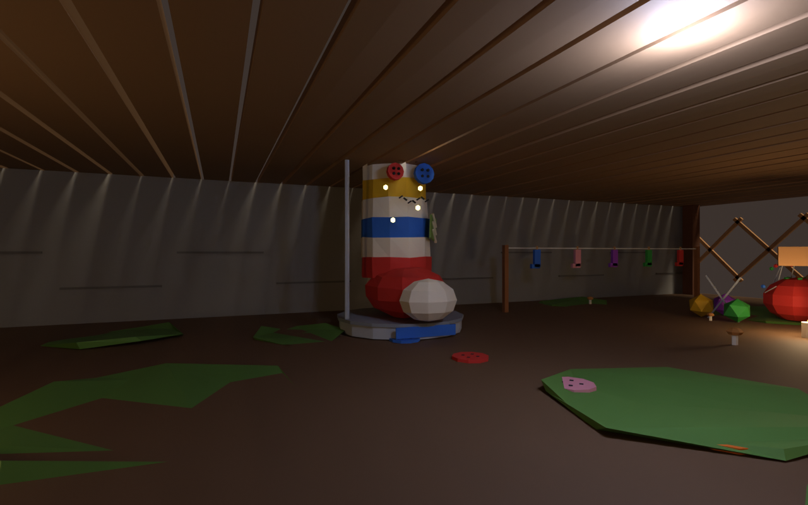
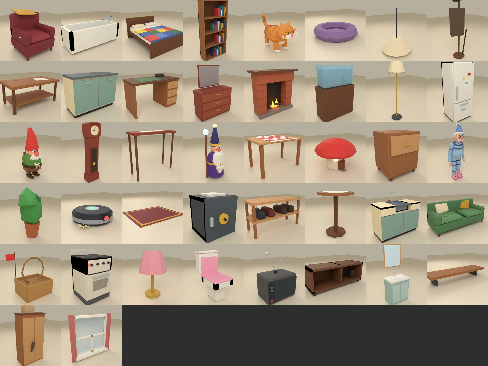
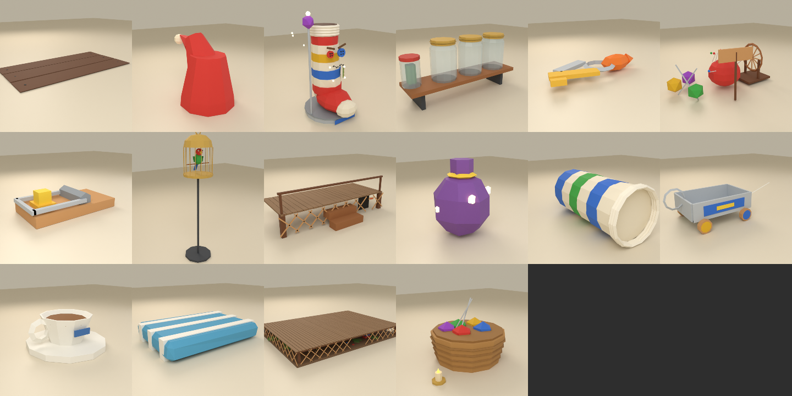

# 🧦 Носочная банда (The Sock Gang)

> Куда пропадают вторые носки, очки и пульт от телевизора? Это мы. Гномы из-под крыльца.

Кооперативная (до 6 игроков) и одиночная 3D-игра на **Unity**. Маленькие гномы-проказники по ночам
пробираются в дом ворчливого деда. Они выполняют проказы из списка Великого Носка, таскают вещи
в деревню под крыльцом и стараются не попасть в банку из-под огурцов.

Все модели сделаны с нуля скриптами в **Blender**: низкополигональные, яркие и нарочно смешные.



| | |
|---|---|
|  |  |
|  |  |

<sub>Уровни собраны скриптом `blender/preview_level.py` по тем же данным и правилам расстановки, что и в игре. В Unity освещение ночное.</sub>




Подробный диздок: [docs/DESIGN.md](docs/DESIGN.md).

---

## Как запустить

1. Установите **Unity Hub** и **Unity 6** (любая версия `6000.0.x`; проект создан в 6000.0.23f1).
   Подойдут и Unity 2021.3 / 2022.3: в коде есть ветки для старых версий API.
2. В Unity Hub выберите **Add → Add project from disk** и укажите папку этого репозитория.
3. Откройте проект. Первый импорт занимает пару минут. Скрипт `SockGangSetup` сам:
   - создаст материалы, чтобы нужные шейдеры попали в сборку;
   - откроет сцену `Assets/Scenes/Main.unity`;
   - включит классический Input Manager.

   Если Unity попросит перезапуск, соглашайтесь.
4. Нажмите **▶ Play**. Сцена пустая специально: деревня, дом, персонажи, звук и интерфейс создаются кодом при запуске.

Готовая игра собирается через меню **Sock Gang → Build → Windows / Linux / macOS**. Результат появится в `Builds/`.

> Нужен встроенный рендер-пайплайн (Built-in). Если проект случайно открылся с URP,
> материалы всё равно найдутся (есть запасные шейдеры), но картинка будет хуже.

## Управление

| Клавиша | Действие |
|---|---|
| **WASD** | ходить |
| **Shift** | бежать (громко!) |
| **Ctrl / C** | красться (тихо, прячет от попугая) |
| **Пробел** | прыжок; в воздухе с колпаком-парашютом — планировать |
| **ЛКМ** | взять / положить вещь |
| **ПКМ** | с вещью в руках — швырнуть; без вещи — **клубок-крюк** (ещё раз — отцепить) |
| **Колесо мыши** | смотать / размотать нитку (или приблизить / отдалить вещь в руках) |
| **R** (держать) | быстро подтянуться на нитке |
| **T** | привязать нитку к тому, на что смотришь (связать две вещи, например тапки деда) |
| **F** | пинок; в банке или в руках деда — вырываться |
| **E** | использовать / положить в карман; держать у банки — откручивать крышку; держать у лаза — уйти домой |
| **Q** | выложить всё из карманов |
| **G** | бросить сонную пыльцу (усыпляет деда) |
| **H** | свистнуть (позвать друзей или отвлечь) |
| **V** | вид от первого / третьего лица |
| **Tab** | развернуть список проказ |
| **Enter** | чат (в кооперативе) |
| **Esc** | пауза / настройки |

## Как играть

1. **Деревня под крыльцом.**
   - Поговорите с **Великим Носком** (E): он даёт советы и хвалит за проказы. Список проказ на ночь появится на экране, когда ночь начнётся.
   - В **вязальне** из добычи вяжется снаряжение: длинная пряжа, тихие пинетки, колпак-парашют, очки ночного видения и др.
   - **Носочный лаз** ведёт в дом. Когда все гномы залезут в лаз, начнётся ночь.
2. **Ночь (8 минут, 00:00 → 06:00).**
   - Выполните хотя бы **3 проказы**: смыть уточку, спрятать дедовы очки в аквариум, связать тапки, раскатать туалетную бумагу…
   - Добычу тащите в **сардинную тележку** у лаза: там она превращается в материалы.
3. **Опасности.**
   - **Дед** просыпается от шума. Пойманного гнома он закатывает в банку на полке, а высоко забравшегося прихлопывает мухобойкой.
   - **Попугай Кеша** орёт «ВОРЫ!» — накройте клетку полотенцем или дайте печеньку.
   - **Кот** охотится на гномов.
   - Под ногами **мышеловки** и **скрипучие половицы**.
4. **Спасение.**
   - Друга в банке можно открутить (держать E у крышки).
   - От прихлопнутого гнома остаётся колпак. Отнесите его в **корзинку с клубками** у лаза, и гном вернётся.
   - В одиночной игре есть 2 запасных колпака.

## Кооператив

- **Хост:** главное меню → «Создать игру». Хост держит мир: деда, кота, вещи. Порт по умолчанию **UDP 27777**, его можно поменять.
- **Остальные:** «Присоединиться».
  - Игры в локальной сети сами появляются в списке.
  - Либо введите IP хоста и порт.

Как играть через интернет, если вы не в одной сети:

| Способ | Что сделать |
|---|---|
| **Radmin VPN / ZeroTier / Hamachi** (проще всего) | Все заходят в одну виртуальную сеть. Хост сообщает свой виртуальный IP (например, `26.x.x.x`), остальные подключаются к нему. |
| **Проброс порта** | На роутере хоста пробросить **UDP 27777** на его компьютер и разрешить игру в брандмауэре Windows. Друзья подключаются к внешнему IP хоста. |

Прогресс (материалы, снаряжение, номер ночи) хранится у хоста: `Application.persistentDataPath/sockgang_save.txt`.

## Устройство проекта

```
Assets/
  Scripts/Core/     правила игры без Unity: предметы, проказы, прогрессия, планировка дома,
                    сетевые сообщения, загрузчик моделей GMDL (покрыто тестами)
  Scripts/Net/      транспорт на LiteNetLib: хост/клиент, поиск игр в локальной сети
  Scripts/Game/     Unity-часть: гномы, дед/кот/попугай, мир, сессия, звук, интерфейс
  Editor/           автонастройка проекта и меню сборки
  Resources/Models/ модели, экспортированные из Blender (*.bytes, формат GMDL)
blender/            скрипты моделей (Python + bpy): персонажи, мебель, предметы, деревня
art/                .blend и .fbx каждой модели (для правок руками)
docs/               диздок и превью моделей
Tests/              xUnit-тесты: правила, модели, сеть (настоящий UDP через localhost), планировка
tools/LevelDump/    выгрузка сгенерированного дома в JSON (для превью в Blender)
tools/UnityCheck/   проверка, что все скрипты Unity компилируются (без самого Unity)
```

### Для разработчиков

```bash
# тесты правил, моделей, сети и планировки дома (313 шт.)
dotnet test Tests/Gnomes.Tests

# проверить, что игровой и редакторный код компилируется против UnityEngine/UnityEditor
dotnet build tools/UnityCheck/Editor.csproj

# пересобрать все модели из Blender (нужен pip install bpy, Python 3.11)
python3 blender/build.py            # всё: GMDL + FBX + .blend + превью
python3 blender/build.py gnome cat  # только эти модели
python3 blender/build.py --sheet    # плюс общая картинка docs/models_sheet.png

# скриншоты уровней без Unity: планировка дома из генератора игры -> сборка и рендер в Blender
dotnet run --project tools/LevelDump -c Release -- 12345 /tmp/layout.json
python3 blender/preview_level.py house /tmp/layout.json docs/shots/house_cutaway.png --view=cutaway
python3 blender/preview_level.py village docs/shots/village.png

# .meta-файлы для новых ассетов (стабильные GUID)
python3 tools/gen_meta.py
```

Все эти проверки запускает GitHub Actions при каждом пуше (`.github/workflows/ci.yml`).
